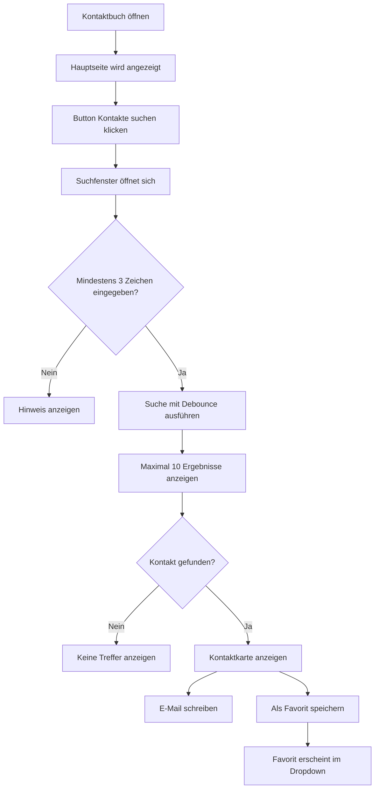

# Konzept: Kontaktbuch in CampusConnect

## 1. Ausgangssituation

Im aktuellen Stand zeigt das Kontaktbuch alle Kontakte direkt als große Karten untereinander an. Dadurch wirkt die Seite sehr voll, unruhig und optisch nicht besonders modern. Außerdem werden alle Kontakte sofort geladen, obwohl Nutzer in den meisten Fällen gezielt nach einer bestimmten Person suchen möchten.

Das Kontaktbuch soll deshalb überarbeitet werden. Ziel ist eine aufgeräumte, performante und benutzerfreundliche Lösung.

---

## 2. Ziel des neuen Kontaktbuchs

Das Kontaktbuch soll es ermöglichen, Personen innerhalb von CampusConnect schnell zu finden und wichtige Kontakte später als Favoriten zu speichern.

Die Hauptseite soll nicht mehr alle Kontakte direkt anzeigen. Stattdessen soll es einen zentralen Button **„Kontakte suchen“** geben. Über diesen Button öffnet sich ein Suchfenster, in dem gezielt nach Personen gesucht werden kann.

Zusätzlich soll es auf der Hauptseite einen aufklappbaren Bereich **„Meine Favoriten“** geben. Dort werden später gespeicherte Favoriten angezeigt.

---

## 3. Grundidee

Die neue Kontaktbuch-Seite besteht aus zwei Hauptbereichen:

1. **Kontakte suchen**

   * Öffnet ein Suchfenster.
   * Kontakte werden erst nach Eingabe einer Mindestanzahl von Zeichen geladen.
   * Die Suche aktualisiert sich automatisch beim Tippen.
   * Es werden maximal 10 Ergebnisse angezeigt.

2. **Meine Favoriten**

   * Aufklappbarer Bereich auf der Kontaktbuch-Seite.
   * Zeigt gespeicherte Favoriten an.
   * Ist standardmäßig eingeklappt oder bei vorhandenen Favoriten optional geöffnet.
   * Die Favoriten-Funktion ist aktuell noch nicht umgesetzt, wird aber im Konzept berücksichtigt.

---

## 4. Aufbau der Hauptseite

Die Hauptseite soll bewusst schlicht bleiben.

### Beispielhafter Aufbau

```text
Kontaktbuch

Finde Personen aus deinem Kurs, Studiengang oder der Verwaltung.

┌──────────────────────────────────────────────┐
│ Kontakte suchen                              │
│ Suche gezielt nach Name, Kurs, Studiengang   │
│ oder E-Mail-Adresse.                         │
│                                              │
│ [ Kontakte suchen ]                          │
└──────────────────────────────────────────────┘

┌──────────────────────────────────────────────┐
│ Meine Favoriten                         ▼    │
└──────────────────────────────────────────────┘
```

---

## 5. Kontakte suchen

Wenn der Nutzer auf **„Kontakte suchen“** klickt, öffnet sich ein Suchfenster.

Dieses Suchfenster kann als Modal umgesetzt werden. Dadurch bleibt der Nutzer auf der Kontaktbuch-Seite, bekommt aber eine klare Suchoberfläche.

### Beispielhafter Aufbau des Suchfensters

```text
┌──────────────────────────────────────────────┐
│ Kontakte suchen                         X    │
│                                              │
│ [ Name, E-Mail, Kurs, Studiengang... ]       │
│                                              │
│ Mindestens 3 Zeichen eingeben, um die Suche  │
│ zu starten.                                  │
│                                              │
│ Suchergebnisse                               │
│                                              │
│ ┌──────────────────────────────────────────┐ │
│ │ JW  Jakob Wußler                 ☆       │ │
│ │     Studierender                         │ │
│ │     TIF25A · Informatik · 2. Semester    │ │
│ │     [E-Mail]                             │ │
│ └──────────────────────────────────────────┘ │
│                                              │
└──────────────────────────────────────────────┘
```

---

## 6. Suchlogik

Die Suche soll nicht sofort beim Öffnen des Fensters alle Kontakte laden.

Stattdessen gelten folgende Regeln:

| Regel                       | Beschreibung                                                  |
| --------------------------- | ------------------------------------------------------------- |
| Mindestlänge                | Die Suche startet erst ab 3 eingegebenen Zeichen              |
| Automatische Aktualisierung | Die Suchergebnisse aktualisieren sich beim Tippen automatisch |
| Verzögerung                 | Die Suche soll mit einer kurzen Verzögerung ausgeführt werden |
| Ergebnislimit               | Es werden maximal 10 Kontakte angezeigt                       |
| Keine Eingabe               | Es wird ein Hinweistext angezeigt                             |
| Keine Treffer               | Es wird ein leerer Zustand angezeigt                          |

Empfohlene technische Werte:

```text
Mindestlänge: 3 Zeichen
Debounce-Zeit: 300–500 ms
Maximale Ergebnisse: 10 Kontakte
```

### Warum Debouncing?

Die Suche soll sich für den Nutzer direkt anfühlen. Trotzdem sollte nicht bei jedem Tastendruck sofort eine Anfrage an das Backend geschickt werden.

Deshalb wird eine kurze Verzögerung verwendet. Erst wenn der Nutzer für z. B. 300 ms nicht weiter tippt, wird die Suche ausgeführt.

Beispiel:

```text
Nutzer tippt: "J"
→ keine Suche, da weniger als 3 Zeichen

Nutzer tippt: "Ja"
→ keine Suche, da weniger als 3 Zeichen

Nutzer tippt: "Jak"
→ 300 ms warten
→ Suche wird ausgeführt

Nutzer tippt weiter: "Jako"
→ vorherige Suche wird ersetzt
→ neue Suche wird nach kurzer Verzögerung ausgeführt
```

---

## 7. Suchergebnisse

Die Suchergebnisse sollen im Suchfenster als kompakte Karten angezeigt werden.

Eine Karte sollte nur die wichtigsten Informationen enthalten.

### Inhalt einer Kontaktkarte

| Information        | Beschreibung                                              |
| ------------------ | --------------------------------------------------------- |
| Initialen / Avatar | Visueller Wiedererkennungswert                            |
| Name               | Vollständiger Name der Person                             |
| Rolle              | Zum Beispiel Studierende, Lehrende, Verwaltung oder Admin |
| Kurs               | Zum Beispiel TIF25A                                       |
| Studiengang        | Zum Beispiel Informatik                                   |
| Semester           | Zum Beispiel 2. Semester                                  |
| E-Mail-Button      | Direkte Kontaktmöglichkeit                                |
| Favoriten-Stern    | Kontakt als Favorit speichern oder entfernen              |

### Beispiel

```text
┌─────────────────────────────────────────────┐
│ JW  Jakob Wußler                    ☆       │
│     Studierender                            │
│     TIF25A · Informatik · 2. Semester       │
│     [E-Mail]                                │
└─────────────────────────────────────────────┘
```

Der Favoritenstatus wird über einen Stern dargestellt:

```text
☆ = nicht als Favorit gespeichert
★ = als Favorit gespeichert
```

---

## 8. Begrenzung auf 10 Ergebnisse

Die Suche soll maximal 10 Kontakte anzeigen.

Dadurch bleibt die Anzeige übersichtlich und es werden nicht unnötig viele Daten geladen. Wenn mehr als 10 Treffer existieren, soll ein Hinweis angezeigt werden.

Beispiel:

```text
10 Treffer angezeigt. Verfeinere deine Suche, um genauere Ergebnisse zu erhalten.
```

Es soll bewusst kein endloses Scrollen oder eine komplette Kontaktliste entstehen. Der Fokus liegt auf gezielter Suche.

---

## 9. Favoriten

Die Favoriten-Funktion existiert aktuell noch nicht, soll aber später ergänzt werden.

Favoriten sind Kontakte, die ein Nutzer häufig benötigt und deshalb speichern möchte.

### Favoriten auf der Hauptseite

Die Favoriten sollen auf der Kontaktbuch-Seite in einem Dropdown angezeigt werden.

Standardansicht:

```text
┌──────────────────────────────────────────────┐
│ Meine Favoriten                         ▼    │
└──────────────────────────────────────────────┘
```

Aufgeklappte Ansicht:

```text
┌──────────────────────────────────────────────┐
│ Meine Favoriten                         ▲    │
│                                              │
│ ┌──────────────────────────────────────────┐ │
│ │ JW  Jakob Wußler                 ★       │ │
│ │     TIF25A · Informatik                  │ │
│ │     [E-Mail]                             │ │
│ └──────────────────────────────────────────┘ │
│                                              │
│ ┌──────────────────────────────────────────┐ │
│ │ TP  Theo Pfaff                   ★       │ │
│ │     TIF25A · Informatik                  │ │
│ │     [E-Mail]                             │ │
│ └──────────────────────────────────────────┘ │
└──────────────────────────────────────────────┘
```

### Leerer Zustand

Wenn ein Nutzer noch keine Favoriten gespeichert hat, soll ein Hinweis angezeigt werden.

```text
Noch keine Favoriten gespeichert.
Suche nach Kontakten und markiere wichtige Personen mit dem Stern.
```

---

## 10. Nutzerfluss



---

## 11. Vorteile des neuen Konzepts

Das neue Konzept bietet mehrere Vorteile gegenüber der aktuellen Darstellung.

### Übersichtlichkeit

Die Seite wirkt aufgeräumter, da nicht mehr alle Kontakte direkt angezeigt werden.

### Performance

Kontakte werden erst geladen, wenn wirklich gesucht wird. Dadurch werden unnötige Datenbankabfragen reduziert.

### Bessere Nutzerführung

Der Nutzer erkennt sofort, dass er gezielt nach Personen suchen kann.

### Skalierbarkeit

Auch bei vielen Nutzern bleibt das Kontaktbuch nutzbar, da maximal 10 Ergebnisse angezeigt werden.

### Favoriten als Mehrwert

Häufig benötigte Kontakte können später gespeichert und direkt auf der Seite angezeigt werden.

---

## 12. Vorgeschlagene Komponentenstruktur

Für die Umsetzung könnte die Funktion in mehrere Komponenten aufgeteilt werden.

```text
ContactsPage
 ├── ContactSearchCard
 ├── FavoritesDropdown
 └── ContactSearchModal
      ├── ContactSearchInput
      ├── ContactSearchResults
      └── ContactResultCard
```

Später für die Favoriten-Funktion:

```text
FavoritesDropdown
 ├── FavoriteContactCard
 └── EmptyFavoritesState
```

Mögliche Services:

```text
ContactService
 ├── searchContacts(query, limit)
 └── getContactById(id)

FavoriteService
 ├── getFavorites()
 ├── addFavorite(contactId)
 └── removeFavorite(contactId)
```

---

## 13. Backend-Anforderungen

Für die Suche wird ein Backend-Endpunkt benötigt, der Kontakte anhand eines Suchbegriffs zurückgibt.

### Beispielhafter Endpunkt

```http
GET /api/contacts/search?query=jak&limit=10
```

### Erwartetes Verhalten

* Der Endpunkt sucht nach Name, E-Mail, Kurs, Studiengang oder Ort.
* Die Suche wird erst vom Frontend aufgerufen, wenn mindestens 3 Zeichen eingegeben wurden.
* Es werden maximal 10 Kontakte zurückgegeben.
* Die Ergebnisse sollen nach Relevanz sortiert werden.

### Beispielhafte Response

```json
[
  {
    "id": "1",
    "firstName": "Jakob",
    "lastName": "Wußler",
    "email": "jakob.wussler@example.com",
    "role": "STUDENT",
    "course": "TIF25A",
    "studyProgram": "Informatik",
    "semester": 2,
    "isFavorite": false
  }
]
```

---

## 14. Anforderungen an die Favoriten-Funktion

Die Favoriten-Funktion ist noch nicht umgesetzt, sollte aber bereits im UI-Konzept berücksichtigt werden.

### Funktionale Anforderungen

* Nutzer können Kontakte als Favorit markieren.
* Nutzer können Kontakte wieder aus den Favoriten entfernen.
* Favoriten werden pro Nutzer gespeichert.
* Favoriten erscheinen im Dropdown auf der Kontaktbuch-Hauptseite.
* Favoriten können direkt per E-Mail kontaktiert werden.

### Mögliche Backend-Endpunkte

```http
GET /api/contacts/favorites
POST /api/contacts/favorites/{contactId}
DELETE /api/contacts/favorites/{contactId}
```

---

## 15. Akzeptanzkriterien

### Kontaktbuch-Hauptseite

* Die Hauptseite zeigt keine vollständige Kontaktliste mehr an.
* Es gibt einen sichtbaren Button **„Kontakte suchen“**.
* Es gibt einen Bereich **„Meine Favoriten“**.
* Der Favoritenbereich ist aufklappbar.

### Suchfenster

* Beim Klick auf **„Kontakte suchen“** öffnet sich ein Suchfenster.
* Das Suchfenster enthält ein Suchfeld.
* Die Suche startet erst ab 3 Zeichen.
* Die Ergebnisse aktualisieren sich automatisch beim Tippen.
* Es werden maximal 10 Ergebnisse angezeigt.
* Bei weniger als 3 Zeichen wird ein Hinweis angezeigt.
* Bei keinen Treffern wird ein leerer Zustand angezeigt.

### Kontaktkarte

* Jede Kontaktkarte zeigt Name, Rolle, Kurs, Studiengang und Semester.
* Jede Kontaktkarte besitzt einen Button zum Schreiben einer E-Mail.
* Jede Kontaktkarte besitzt einen Favoriten-Stern.
* Der Favoriten-Stern zeigt an, ob ein Kontakt bereits favorisiert wurde.

### Favoriten

* Favorisierte Kontakte erscheinen im Bereich **„Meine Favoriten“**.
* Wenn keine Favoriten existieren, wird ein Hinweis angezeigt.
* Favoriten können wieder entfernt werden.

---

## 16. Offene Fragen

Folgende Punkte müssen noch im Team geklärt werden:

* Soll die Suche nur innerhalb der eigenen DHBW oder campusweit funktionieren?
* Dürfen alle Rollen alle Kontakte sehen?
* Sollen E-Mail-Adressen direkt sichtbar sein oder nur über einen Button geöffnet werden?
* Sollen Lehrende und Verwaltung anders hervorgehoben werden als Studierende?
* Soll es zusätzliche Filter nach Rolle, Kurs oder Studiengang geben?
* Soll der Favoritenbereich standardmäßig geöffnet oder geschlossen sein?
* Werden Favoriten lokal im Frontend oder dauerhaft im Backend gespeichert?

---

## 17. Zusammenfassung

Das Kontaktbuch soll von einer großen Kontaktliste zu einer gezielten Suchfunktion umgebaut werden.

Die neue Lösung besteht aus:

* einer aufgeräumten Hauptseite,
* einem Button **„Kontakte suchen“**,
* einem Suchfenster mit automatischer Suche,
* einer Mindestlänge von 3 Zeichen,
* maximal 10 Suchergebnissen,
* kompakten Kontaktkarten,
* einem Favoriten-Stern,
* und einem aufklappbaren Favoritenbereich.

Dadurch wird das Kontaktbuch übersichtlicher, moderner und besser skalierbar.
