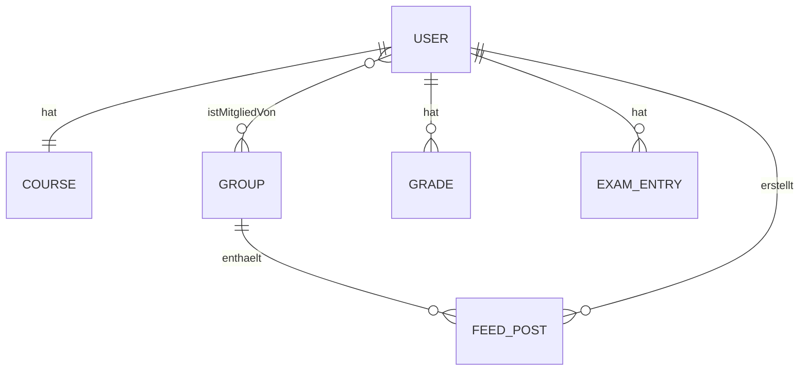

# Produktanforderungsdokument (PRD) – MVP

> **Status: Produktanforderungen und Zielbild.** Dieses Dokument ist keine Beschreibung des aktuellen Implementierungsstands. Für vorhandene Endpunkte, Datenmodelle und technische Regeln sind `AGENTS.md`, `CampusConnect/docs/api.md`, `CampusConnect/docs/architecture.md` und der Live-Code maßgeblich.

## 1. Produktvision

> CampusConnect ist ein zentrales, webbasiertes Portal für Studierende, Lehrpersonen und Verwaltung der DHBW Lörrach, das Studienalltag‑Infos und Kern‑Workflows (News‑Feed, Gruppen, Mensa, Stundenplan, Noten, Kontakte) an einem Ort bündelt.

## 2. Problem / Opportunity

- Informationen sind aktuell verteilt (WhatsApp, E‑Mail‑Verteiler, Aushänge) und schwer auffindbar.
- Erstsemester fehlt ein strukturierter Einstieg und ein „Single Source of Truth“.
- Termine/Noten werden manuell in eigenen Tabellen gepflegt → Aufwand + Fehler.

## 3. Zielgruppe (Proto‑Persona)

| Eigenschaft            | Beschreibung                                                                                                                   |
| ---------------------- | ------------------------------------------------------------------------------------------------------------------------------ |
| **Name**               | Lea Beispiel                                                                                                                   |
| **Rolle / Funktion**   | DHBW‑Studentin (Erstsemester)                                                                                                  |
| **Hauptbedarf / JTBD** | „Ich will meinen Studienalltag schnell organisieren und relevante Infos zuverlässig finden, ohne in Chats/E‑Mails zu suchen.“ |
| **Nutzungskontext**    | Mobil/Notebook zwischen Vorlesungen; kurze Sessions; Bedarf an schnellen Übersichten                                           |

## 4. Abnahmekriterium

> **Definition of Done:** 100 % der Must‑have‑Features sind implementiert und gemäß Akzeptanzkriterien abgenommen.

## 5. MVP‑Scope (Must‑haves)

| Feature                                  | Akzeptanzkriterien                                                                                                                                                                                                                                      |
| ---------------------------------------- | -------------------------------------------------------------------------------------------------------------------------------------------------------------------------------------------------------------------------------------------------------- |
| Nutzeranlage (Admin)                    | • Admin kann Nutzerkonten im Admin‑Bereich anlegen (E‑Mail, DisplayName, Kurs, Rolle, Initialpasswort; keine Domain‑Restriktion) • Nutzer kann sich mit Initialpasswort einloggen und wird in den Erstlogin‑Prozess geführt                         |
| Auth (Login/Logout)                     | • Login/Logout funktionieren für durch Admin angelegte Nutzerkonten (keine Self‑Service‑Registrierung im MVP) • Private Bereiche/Endpunkte sind geschützt; Token wird nicht persistent im Browser gespeichert                                        |
| Onboarding (Erstlogin)                  | • Nutzer muss beim ersten Login (oder nach Admin‑Reset) das Initialpasswort ändern (verpflichtend) • Nach Passwortwechsel kann der Nutzer die App normal nutzen                                                                                      |
| Rollen & Berechtigungen                 | • Rollen `Student`, `Lecturer`, `Management`, `Admin` sind nutzbar und in der UI verständlich benannt • Lecturer: kann in Kursgruppen posten/kommentieren/reagieren, Kursgruppen verwalten, in Official posten und Campusgruppen erstellen    |
| Profil & Kurszuordnung                  | • Nutzer kann Anzeigename + Kurs + Telefon + Standort im Profil pflegen • Kursliste ist abrufbar und im UI auswählbar                                                                                                                               |
| News‑Feed (gruppenbasiert)              | • Feed zeigt Beiträge aus berechtigten Gruppen (Kurs/Official/Campus) inkl. Kommentare/Reaktionen • Nutzer mit Schreibrecht kann Beitrag erstellen, kommentieren, reagieren; eigener Beitrag/Kommentar ist löschbar                                 |
| Gruppen                                 | • Nähere Informationen in Dokumentation gruppenfunktion_konzept_campusconnect.md  |                                                   |
| Mensa‑Speiseplan                        | • Wochenansicht für Mensa Lörrach (Ort‑ID 677) wird geladen und angezeigt • Fehlerfälle (API down/leer) werden nutzerfreundlich dargestellt                                                                                                          |
| Noten‑Tracker                           | • Nutzer kann Noten inkl. ECTS erfassen, anzeigen und löschen (manuell; keine Studienplan‑UI im MVP) • Notendurchschnitt wird aus erfassten Noten berechnet und angezeigt                                                                           |
| Stundenplan                             | • Nutzer kann Stundenplan für Kurs abrufen und anzeigen (`days` optional) • Bei fehlendem Kurs im Profil wird Nutzer geführt (Kurs auswählen)                                                                                                        |
| Kontaktbuch                             | • Nutzer kann Personen suchen (Name/E‑Mail/Kurs/Studiengang/Ort) und Kontaktdaten einsehen • Sichtbar: Name, E‑Mail, Kurs, Studiengang, Telefon, Standort (keine Profilnotiz)                                                             |
| Admin‑Bereich                           | • Admin kann Nutzer verwalten (Rolle/Kurs ändern, löschen, Passwort zurücksetzen) und Kurse anlegen/listen • Admin‑Zugriff ist geschützt (nur `Admin`)                                                                                               |
| Onboarding‑Feed/Guided Start            | • Spezifikation siehe onboarding.md             |
| Anpassung auf Laptop und Ipad           | - Website soll auf Laptop als auch Ipad zugeschnitten werden|

<!-- Weitere Features bei Bedarf … -->

## Could Haves

- Anpassung fürs Handy wenn noch Zeit
- Darkmode
- Prüfungskalender in den eigene Prüfungen eingetragen werden können

## 6. Nicht‑Ziele

- Native Mobile App (kein iOS/Android).
- LMS/Moodle‑Ersatz (kein Lernmaterial‑Upload, keine Kursverwaltung).
- Echtzeit‑Chat / privates Messaging.
- Self‑Service Registrierung / offene Registrierung (Accounts nur zentral durch Admin).
- Prüfungskalender im UI (Backend darf bestehen, aber nicht MVP‑Feature).
- Studienplan‑Ansicht/Modulauswahl im UI (Backend darf bestehen, aber nicht MVP‑Feature).
- Reminder/Push‑Benachrichtigungen für Prüfungen im MVP.
- Profilnotiz‑Funktion.
- Offizielle Noten‑Integration (Dualis) – nur persönlicher Tracker.
- Multi‑Mandant (andere Hochschulen) und Gamification.

<!-- … -->

## 7. Zeitplan & Meilensteine

| Meilenstein      | Datum      |
| ---------------- | ---------- |
| Kick‑off         | 2026-05-11 |
| Konzeptabschluss | 2026-05-17 |
| **Scope‑Freeze** | 2026-05-20 |
| Code‑Freeze      | 2026-06-23 |
| Generalprobe     | 2026-06-26 |
| Pitch‑Termin     | 2026-06-29 |
| Retrospektive    | 2026-06-30 |

## 8. Offene Fragen

| Frage                                      | Verantwortlich | Fällig am  |
| ------------------------------------------ | -------------- | ---------- |
| Keine offenen Fragen (Stand 2026-05-11). | PM             | 2026-05-11 |

<!-- … -->

---

### Glossar & Domänenobjekte (optional)

| Begriff         | Definition                                            |
| --------------- | ----------------------------------------------------- |
| Kurs            | Akademische Zugehörigkeit (Code, Studiengang, Semester) |
| Gruppe          | Kontext für Feed/Community (Course/Official/Social)   |
| Feed‑Post       | Beitrag innerhalb einer Gruppe, inkl. Kommentare/Reaktionen |
| Prüfungseintrag | Persönlicher Kalendereintrag für Prüfungen            |
| Noteneintrag    | Persönliche Note (optional mit Modul aus Studienplan) |

### High‑Level‑Domänenmodell (optional)

